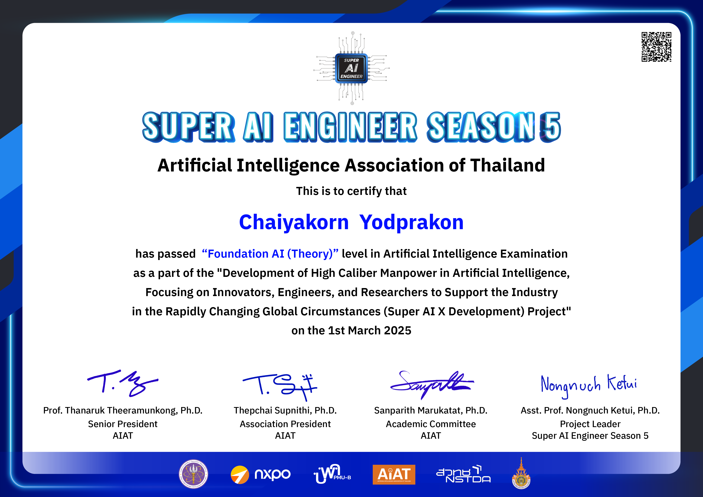

# Hi there 👋, I'm Chaiyakorn (Jack) 

**4th Year Computer Science Student | Full-Stack Developer (Vue.js & Nuxt.js)**

  

---

### 🎓 About Me
- 🎓 **4th Year Computer Science Student** at Buriram Rajabhat University.
- 💻 **Full-Stack Developer** with a strong focus on the **Vue.js** and **Nuxt.js** ecosystems to build high-performance, modern web applications.
- 🤖 Experienced in integrating **existing AI APIs**, **RAG** (Retrieval-Augmented Generation), and Workflow Automation (**n8n**) to create scalable solutions efficiently.
- 🎯 Currently seeking **Internship opportunities** as a Full-Stack Developer.

---

### 🛠️ Tech Stack & Tools

**Frontend Development**  
 
 
 
 
 

**Backend & Database**  
 
 

 
 
 

**AI, Integrations & DevTools**  
 
 
 
 
 
 

**Other Skills:**  
 

---

### 🏅 Certificates & Awards

  
   
  <b>🏆 Super AI Engineer Development Program Innovator 2025</b>

 

**📄 Other Certifications:**
- [สถาบันคุณวุฒิวิชาชีพ: สาขาวิชาชีพอุตสาหกรรมดิจิทัล อาชีพนักพัฒนาระบบ](./certificate/สาขาวิชาชีพอุตสาหกรรมดิจิทัล%20อาชีพนักพัฒนาระบบ.pdf)
- [8th BRICC Festival 2025: เกียรติบัตรการแข่งขันโครงการ 20 ทีมสุดท้าย](./certificate/เกียรติบัตร-bricc-2025-20ทีม.pdf)
- **AI Architecture:** Designed the Phattharaborpit School AI Chatbot.

---

### 📚 Research & Academic Projects

**👁️ AI-Powered Image-to-Audio Description for the Visually Impaired (NSC Project)**
- Research and development of an automated image captioning system designed to assist the visually impaired.
- **Core Architecture:** Heavily inspired by the **"Attention Is All You Need"** concept, the system relies on advanced Attention mechanisms to process visual and sequential data. It utilizes an Encoder-Decoder architecture, combining **ConvNeXt** with the **Bottleneck Attention Module (BAM)** for precise spatial and channel feature extraction, and an **LSTM with Additive Attention** for contextual sequence generation.
- **Localization:** Trained on specialized datasets featuring Thai culture, food, and environments to ensure accurate, context-aware descriptions.
- **Tech Stack:** `React Native` `Bun` `Python` `PyTorch`

---

### 🚀 Featured Development Projects

**🧺 SaiJai Phareab Laundry Service (Senior Project | Ongoing)**
- A comprehensive full-stack management system for laundry services.
- **Key Features:** Automated Queue Sorting, real-time order tracking, and an AI Chatbot for automated customer service.
- **Tech Stack:** `Nuxt.js` `TypeScript` `PostgreSQL` `Prisma`

**🧠 Mental Health Support & Depression Screening AI Chatbot**
- Developed for the 8th BRICC Festival 2025.
- An AI chatbot designed for initial mental health screening, processing conversational data from online communities to provide contextually empathetic responses.

---

  

